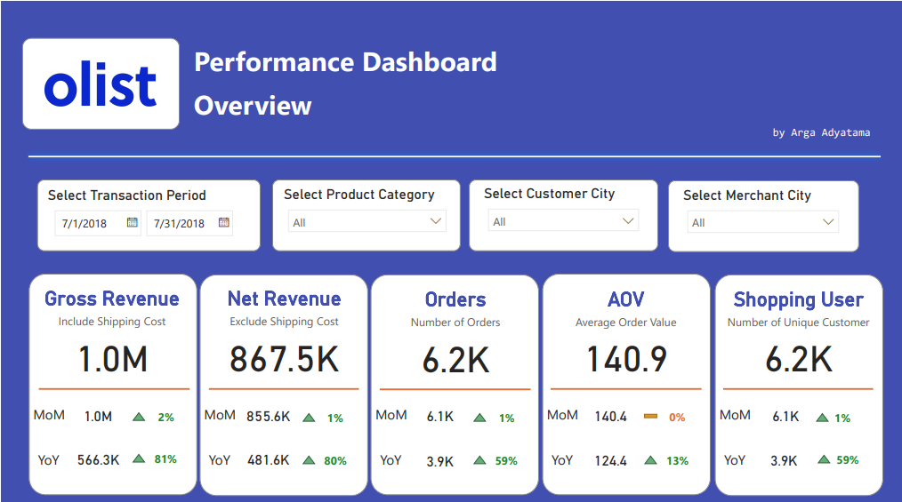

# Olist E-Commerce Performance Dashboard

This is my personal project to learn how to build a dashboard in Power BI. The dataset is acquired from [Kaggle](https://www.kaggle.com/datasets/olistbr/brazilian-ecommerce). It has information on e-commerce transactions from 2016 to 2018 made at multiple marketplaces in Brazil. It consists of various tables with the following is the one that I will use for the project:

- `order`: information about each purchase and their time
- `orer_item`: details about each order, what items are purchased
- `seller_id`: geographic information about the seller/merchant
- `customer_id`: geographic information about the customer
- `product_category`: translation of the product category from latin to english

The data preprocessing steps are done in python using [Google Colab](https://colab.research.google.com/drive/11PPWOufHGbk5l0hWbgEmHKBpDvbGZbk1?usp=sharing). Unfortunately, I don't have any organization Microsoft account so I can only export my dashboard into a [PDF file](https://github.com/Argaadya/olist_ecommerce_dashboard/blob/main/ecommerce_dashboard.pdf), which is also embedded in this repository.
