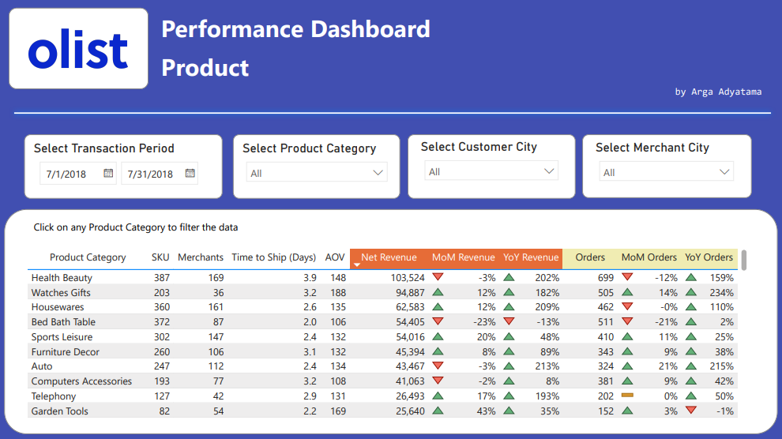
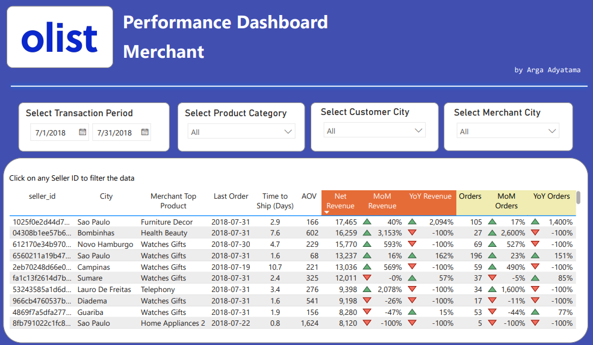

# Olist E-Commerce Performance Dashboard

This is my personal project to learn how to build a dashboard in Power BI. The dataset is acquired from [Kaggle](https://www.kaggle.com/datasets/olistbr/brazilian-ecommerce). It has information on e-commerce transactions from 2016 to 2018 made at multiple marketplaces in Brazil. It consists of various tables with the following is the one that I will use for the project:

- `order`: information about each purchase and their time
- `order_item`: details about each order, what items are purchased
- `seller_id`: geographic information about the seller/merchant
- `customer_id`: geographic information about the customer
- `product`: master information about each SKU, including the product category in latin, item weight, and item dimension
- `product_category_name_translation`: translation of the product category from latin to english

The data preprocessing steps are done in python using [Google Colab](https://colab.research.google.com/drive/11PPWOufHGbk5l0hWbgEmHKBpDvbGZbk1?usp=sharing). Unfortunately, I don't have any Microsoft organization account so I can only export my dashboard into a [PDF file](https://github.com/Argaadya/olist_ecommerce_dashboard/blob/main/ecommerce_dashboard.pdf), which is also embedded in this repository.

## Data Preprocessing Steps

Before I build the dashboard in Power BI, first I want to check the data, remove any undesirable conditions such as missing values or duplicated rows, and also to gain more understanding, both technical-wise and business-wise, regarding each column on the dataset. The result of data processing steps are a set of clean .csv files stored in the [clean_data folder](https://github.com/Argaadya/olist_ecommerce_dashboard/tree/main/clean_data).

The following are steps and insights that I have done to process the data before feeding it into Power BI:

- Despite being an online marketplace, the data only has 1 order/purchase for each customer ID. I think this is not a realistic situation and it makes it hard to create any customer segmentation outside of the customer's geographical location since I cannot build an RFM segmentation (all customer has 1 purchase only).
- Some orders are either still processed, in an out-of-stock situation, or being canceled. We remove these rows and make sure that we only use successful orders that contain no missing values on all of the time information from purchase timestamp to delivered to customer timestamp.
- Remove any duplicated rows in all of the dataset.
- Get the proper product category name in english by merging the `product` table with the `product_category_name_translation` table
- Change the customer city and seller/merchant city into proper title case

## The Dashboard Structure

The dashboard consists of 4 different pages:

- Overview: the general performance of the company
- Product: detailed performance of each product or product category
- Merchant: detailed performance of each merchant
- Customer: detailed performance of each customer

### Pages 1 - Overview

This page shows the general performance of the e-commerce and highlights 5 main metrics: 

- Gross Revenue: sum of total sales from each item and the shipping cost
- Net Revenue: sum of total sales from each item
- Orders: Total unique number of orders
- AOV: Average Order Value, the average value or total sales of a single order
- Shopping User: Number of unique shopping customer

Each metrics are accompanied by a comparison to the previous month and year to give more information about the company's current performance. As of July of 2018, the company gained a small growth (1%) in sales (net revenue) compared to last month, but has grown significantly compared to last year (80%).

The metrics are followed by 2 bar charts that show where are the customers located and the top product category by net revenue. 

  

On the bottom side of the page, we show the daily trend for the sales and the number orders.

  

### Page 2 - Product

This page shows the detailed performance of each product category, with currently the Health Beauty category still ranking at the top and giving the most revenue in the marketplace. The table shows the following information about each product category:

- SKU: Number of unique items are sold on the category
- Merchants: Number of merchants that sold the product category
- Time to Ship: average of how many days it took for an order to be shipped since the time of purchase
- Net revenue gained and total orders from each product category and the comparison to previous month and year

  

We can also see the top sku based on sales and the top rising products that has the highest growth compared to previous month.

  

### Page 3 - Merchant

This page shows the detailed performance of each merchant and what are they selling.

  

### Page 4 - Customer

This page shows the detailed performance of each customer and what are they buying.

  

